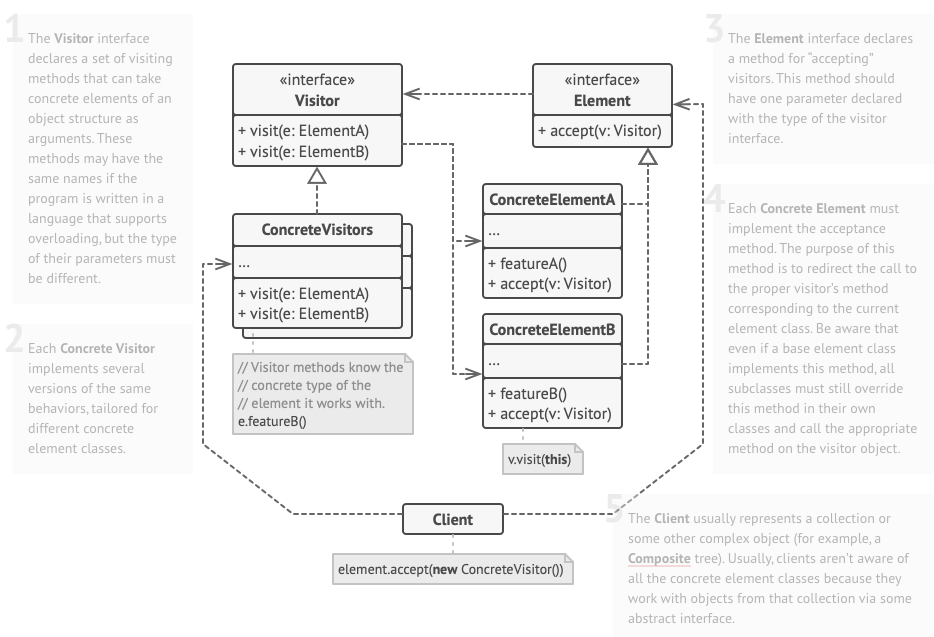

# Visitor

# Definition

- Represent an operation to be performed on elements of an object structure. Visitor lets you define a new operation without changing the classes of the elements on which it operates.
- The visitor pattern comes in to solve the lack of ***Double Dispatch*** in some programming languages.

### Double Dispatch

- Let’s say we have an interface called animal and two concrete classes cat and animal.

 

```tsx
export interface Animal() {
	makeNoise() : void;
}

export class Dog implements Animal {
	makeNoise() : void {
		console.log("Dog is barking");
	}
	interactWithCat(cat : Cat) {
		console.log("Dog is barking with the cat");		
		cat.makeNoise();
	}
}

export class Cat implements Animal {
	makeNoise() : void {
		console.log("Cat is meowing");
	}
	interactWithDog(dog : Dog) {
		console.log("Cat is meowing with the dog");		
		cat.makeNoise();
	}
}

function main() {
	const cat : Cat = new Cat();
	
	const dog : Animal = new Dog();
	
	/* 
   * Because of no support of double dispatching, this will produce any error
   * as we cannot invoke any other type than Animal at run type despite having
   * an underlying type of the Dog.
   */
	cat.interactWithDog(dog);

}

/*****************************************************************************/

// Here comes the the visitor pattern to the rescue

export interface Animal() {
	makeNoise() : void;
	accept(visitor : Visitor);
}

export class Dog implements Animal {
	makeNoise() : void {
		console.log("Dog is barking");
	}
	//interactWithCat(cat : Cat) {
	//	console.log("Dog is barking with the cat");		
	//	cat.makeNoise();
	//}
	accept(visitor : Visitor) {
		visitor.accept(this);
	}

	bark() : void {
		console.log("Bark bark");
	}
}

export class Cat implements Animal {
	makeNoise() : void {
		console.log("Cat is meowing");
	}
	//interactWithDog(dog : Dog) {
	//	console.log("Cat is meowing with the dog");		
	//	cat.makeNoise();
	//}

	meow() : void {
		console.log("meow meow");
	}
}

export interface AnimalVisitor {
	interactWithDog(dog : Dog);
	interactWithCat(dog : Animal);
}

export class CatInteractorVisitor implements AnimalVisitor {
	private dog : Dog;

	constructor(dog : Dog) {
		this.dog = dog;
	}
	
	public interactWithDog(dog : Dog) {
		dog.makeNoise();
		cat.bark();
	}

	public interactWithCat(cat : Cat) {
		throw new Error("cats do not love each other");
	}
}

export class DogInteractorVisitor implements AnimalVisitor {
	private cat : Cat;

	constructor(cat : Cat) {
		this.cat = cat;
	}
	
	public interactWithDog(dog : Dog) {
		throw new Error("dogs do not love each other");
	}

	public interactWithCat(cat : Cat) {
		cat.makeNoise();
		cat.meow();
	}
}
```

# Why is Visitor Pattern used?

- The visitor design pattern is a way of separating an algorithm from an object structure on which it operates.
- A practical result of this separation ***is the ability to add new operations to existing object structures without modifying the structures***. (The Visitor pattern suggests that you place the new behavior into a separate class called *visitor*, instead of trying to integrate it into existing classes.)
- The visitor pattern implements the Open/Closed principle, by closing the modification complex visited structure and opening the ability to add functionality to a new visitor.
- The pattern lets you make the primary classes of your app more focused on their main jobs by extracting all other behaviors into a set of visitor classes.
- You can extract this behavior into a separate visitor class and implement only those visiting methods that accept objects of relevant classes, leaving the rest empty.

# How does it work?

## How to implement it?

- Declare the visitor interface with a set of “visiting” methods, one per each concrete element class that exists in the program. (It is the responsibility of the visitor to implement the method it is only concerned with and the others, it should throw an error). IMPORTANT: **The Visitor interface will be having the methods for *ALL* the** **possible** **operations by the implemented**
- Declare the element interface. If you’re working with an existing element class hierarchy, add the abstract “acceptance” method to the base class of the hierarchy. This method should accept a visitor object as an argument.
- Implement the acceptance methods in all concrete element classes. These methods must simply redirect the call to a visiting method on the incoming visitor object which matches the class of the current element.
- ***The element classes should only work with visitors via the visitor interface.***
- ***Visitors, however, must be aware of all concrete element classes, referenced as parameter types of the visiting methods.***
- The client must create visitor objects and pass them into elements via “acceptance” methods.

# UML



# Examples:

### The first example of using the visitor pattern in the V8 chrome engine, where the zoom functionality is applied across different tabs.

```cpp

void RenderThreadImpl::OnSetZoomLevelForCurrentURL(const std::string& scheme,
                                                   const std::string& host,
                                                   double zoom_level) {
	// What is happening here?
	/*
   * Once the zoom button is clicked, this function OnZoomLevelForCurrentURL is
   * called, An instance of RenderViewZoomer is instantiated.
   * This RenderViewZoomer implements the Visitor interface
   * The render view has a method called ForEach which iterates through the tabs
   * that are opened and the visitor implementor is passed.
   * 
	 */
	// Constructor of zoomer is called
  RenderViewZoomer zoomer(scheme, host, zoom_level); 
  RenderView::ForEach(&zoomer);

}	

/*
 * The RenderViewZoomer is an implementation of a visitor that traverses
 * the tabs and applies the zoom function on each tab
 */
class RenderViewZoomer: public RenderViewVisitor
{
	public: RenderViewZoomer(const std::string &scheme, const std::string &host,
			double zoom_level): scheme_(scheme),
	host_(host),
	zoom_level_(zoom_level) {}

  /* 
   * Each RenderView will call the Visit on the RenderViewZoomer and pass the
   * this pointer to the visitor.
   */
	virtual bool Visit(RenderView *render_view) OVERRIDE
	{
		WebView *webview = render_view->GetWebView();
		WebDocument document = webview->mainFrame()->document();
		// Don't set zoom level for full-page plugin since they don't use the same
		// zoom settings.
		if (document.isPluginDocument())
			return true;
		GURL url(document.url());
		// Empty scheme works as wildcard that matches any scheme,
		if ((net::GetHostOrSpecFromURL(url) == host_) &&
			(scheme_.empty() || scheme_ == url.scheme()) &&
			!static_cast<RenderViewImpl*> (render_view) -
			> uses_temporary_zoom_level())
		{
			webview->hidePopups();
			webview->setZoomLevel(zoom_level_);
		}

		return true;
	}

	private: const std::string scheme_;
	const std::string host_;
	const double zoom_level_;
	DISALLOW_COPY_AND_ASSIGN(RenderViewZoomer);
};

/* 
 * Here is the core functionality of the visitor pattern, We are passing the
 * reference of each element to the visitor and it is the responsibility of the
 * visitor pattern.
 */
void content::RenderView::ForEach(content::RenderViewVisitor* visitor){
	ViewMap* views = g_view_map.Pointer();
	for(ViewMap::iterator it = views->begin(); it != views->end(); ++it) {
		if (!visitor->Visit(it->second))
			return;
	}	
}
```

### The second example is having an extension uninstalled and if there is a page of the extension opened, then all of them will be closed

```cpp
std::vector<content::RenderView*> ExtensionHelper::GetExtensionViews(
    const std::string& extension_id,
    int browser_window_id,
    chrome::ViewType view_type) {
  ViewAccumulator accumulator(extension_id, browser_window_id, view_type);
  content::RenderView::ForEach(&accumulator);
  return accumulator.views();
}
```

### This is exactly what the Visitor Pattern intends to do, separate the functionality from a complex data structure like the tabs.

### Advantages of Visitor Pattern?

- Open/Closed principle, new functionality can be added to the complex tree or the visited structure without having to add new method definitons, there is one method that accepts the interface visitor and the functionality depends on the type of the visitor type.
    - So for example, if we want to zoom, we will instantiate an instance of the visitor that applies the zoom and iterate through the tabs and pass the visitor.
    - The tab will pass itself to the visitor and the visitor will used the passed visited object to carry out of the process of zooming on it.

### Disadvantages of Visitor Pattern?

- Visitors might lack the necessary access to the private fields and methods of the elements that they’re supposed to work with.

# Summary

- Use the Visitor when you need to perform an operation on all elements of a complex object structure (for example, an object tree).
- Use the Visitor to clean up the business logic of auxiliary behaviors.
- Use the pattern when a behavior makes sense only in some classes of a class hierarchy, but not in others.
- You can extract this behavior into a separate visitor class and implement only those visiting methods that accept objects of relevant classes, leaving the rest empty.